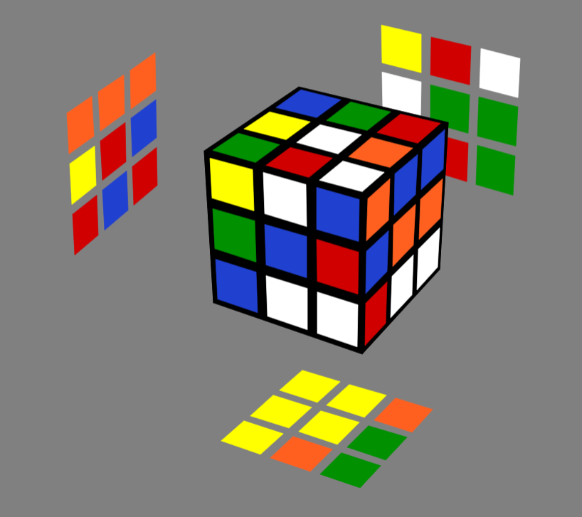
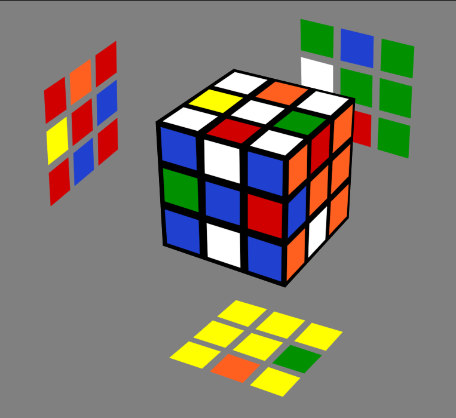
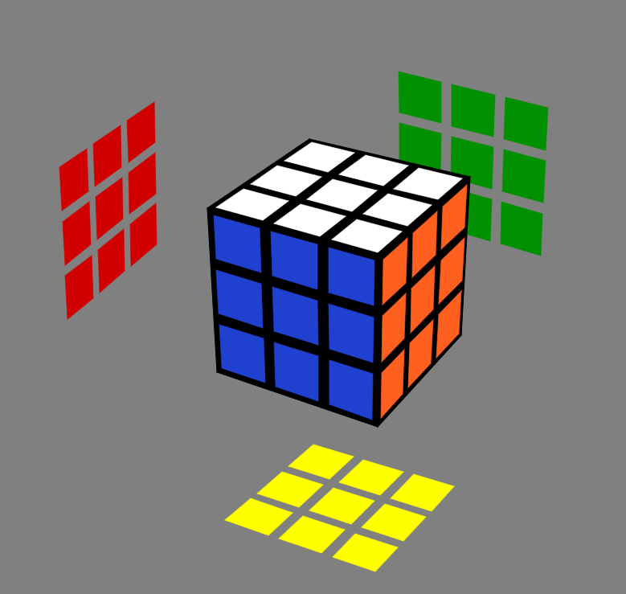
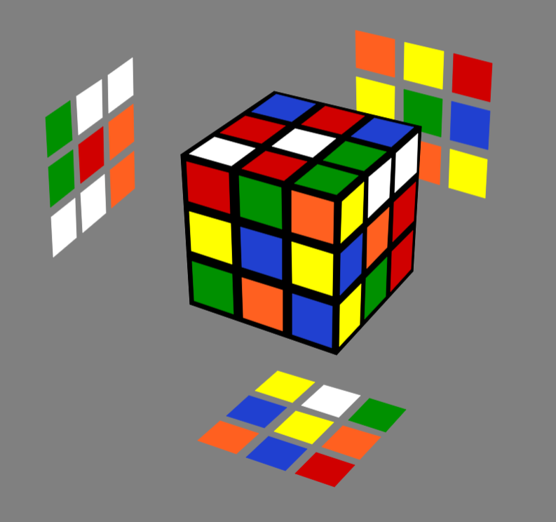
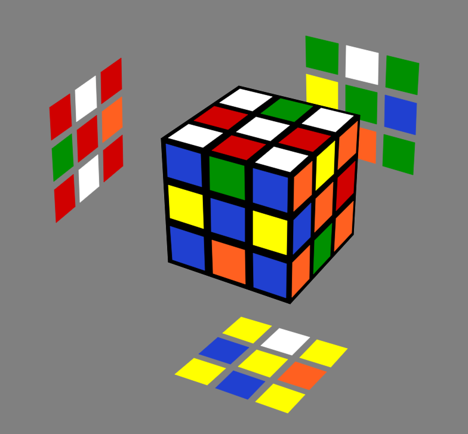
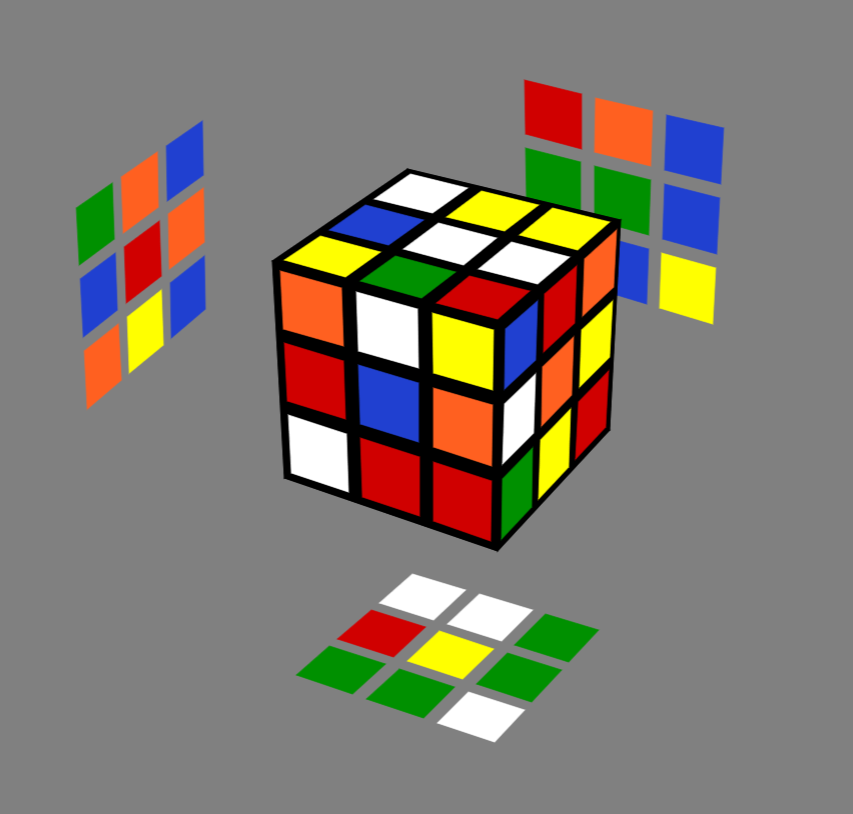
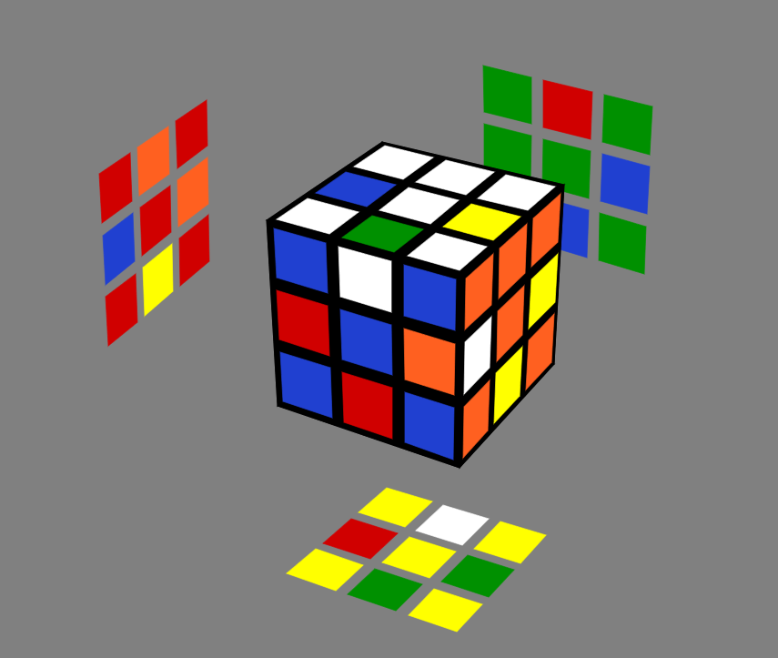
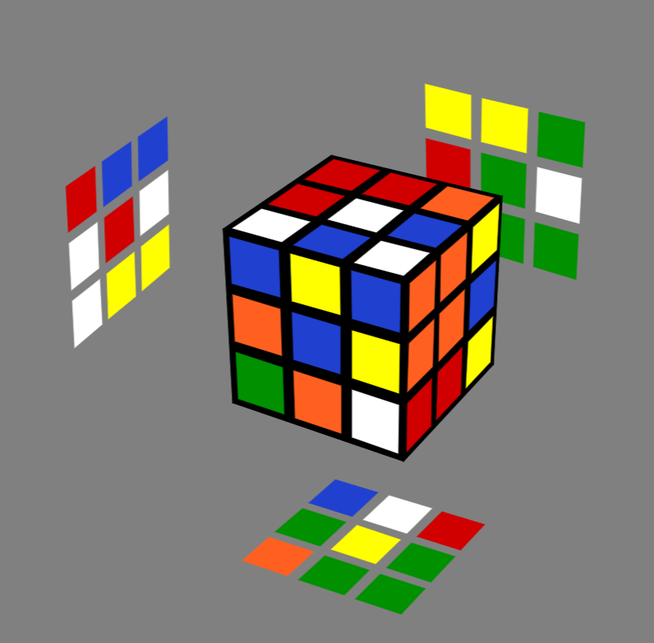
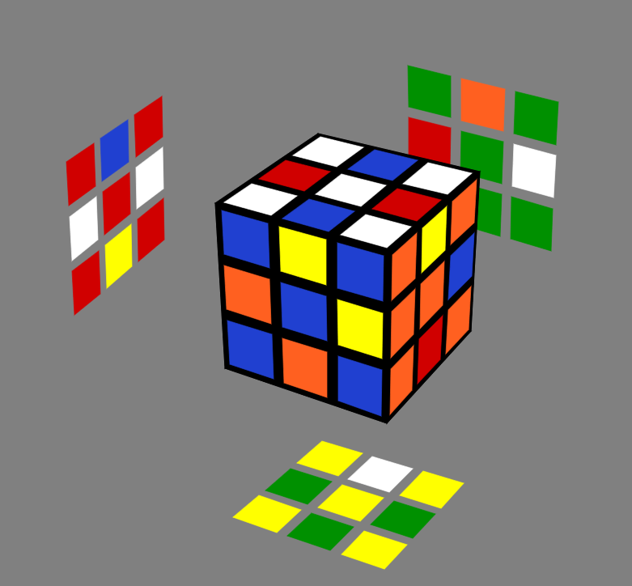

# mono
One algorithm to rule them all!

## The basic idea

If the parity is not disturbed during move execution, then the edge lattice and corner lattice can be solved separately without affecting each other. That is precisely what <a href="https://github.com/e-t-sudo/cerb">Cerb</a> and Mono solvers are based on. They permute the edge peices and the corner peices in different stages without distrubing the rest of the cube. The algorithm is itself fairly simple. In fact, it is probably the closest one could get to an intuitive solve without having to learn multiple move sequences. This algorithm basically comes down to solving the entire cube by a series of swaps. It would be theoritically very easy(not neccessarily fast) to solve the cube using a single algorithm that can swap two peices without affecting the rest of the cube. But alas, such an algorithm does not exist because it is not possible to swap two cubelets on a Rubik's cube without disturbing the other peices. But, we have many algorithms that do something which closely resembles that. For instance, in PLL stage of CPOF, we have the following non-exhaustive list of standard algorithms - 
* U-Perms and A-Prems that cycle triplets of edge or corner peices in clockwise or counter clockwise directions
* H-Perms, E-Perms, Z-Perms that swap two pairs of edge peices while keeping the rest of the cube intact
* F-Perms, J-Perms, N-Perms, R-Perms, T-Perms, V-Perms and Y-Perms are the most interesting of the three classes because these algorithms swap a pair of edge peices and a pair of corner peices without altering any other cubelets. Any one of these algorithms can be used to completely solve a Rubik's cube by a series of appropriate swaps. 

## What's so special about Mono?

Mono Rubik's cube solver is an upgrade over the <a href="https://github.com/e-t-sudo/cerb">Cerb</a> solver. Cerb solves the 3x cube in three stages - orientation of corner peices, permuation of corner peices and permutation of edge peices. Mono however combines the corner orientation and permuation steps, thereby making the implementation much simpler and also significantly decreasing the average number of moves in the generated solution. 

## Usage

Mono uses the same <a href="https://github.com/e-t-sudo/cerb#Usage">lettering scheme</a> as the cerb solver. Create the edge(Path: `EDGE_CONFIG_FILE_PATH`) and corner (Path: `CORNER_CONFIG_FILE_PATH`) configuration files for your scrambled cube and invoke `solution(EDGE_CONFIG_FILE_PATH, CORNER_CONFIG_FILE_PATH)` function which returns the solution move sequence as s `std::string`

## Tests
These tests were performed using the <a href="https://github.com/e-t-sudo/cerberus">cerberus</a> simulator.

### Test (I)
<table>
  <thead><th>Stage</th><th>Cube State</th><th>Move Sequence</th></thead>
  <tr><td>Scrambled Cube</td><td></td><td><b>B2 D U2 L R2 B' U' R U R' U2 R' D2 R2 U D B' F' U' R2 D' B' F2 D B</b></td></tr>
  <tr><td>Corners Solved</td><td></td><td><b>F F' U B' U2 F U' F' U2 F B U' F' D2 L' F F' U B' U2 F U' F' U2 F B U' F' L D2 L2 F2 F' U B' U2 F U' F' U2 F B U' F2 L2 D' L' F F' U B' U2 F U' F' U2 F B U' F' L D L2 F2 F' U B' U2 F U' F' U2 F B U' F2 L2</b></td></tr>
  <tr><td>Edges Solved</td><td></td><td><b>F' U B' U2 F U' F' U2 F B U' E' L D M2 F' U B' U2 F U' F' U2 F B U' M2 D' L' E L D M2 F' U B' U2 F U' F' U2 F B U' M2 D' L' M F' U B' U2 F U' F' U2 F B U' M' D' M F' U B' U2 F U' F' U2 F B U' M' D D2 M F' U B' U2 F U' F' U2 F B U' M' D2 M D2 M F' U B' U2 F U' F' U2 F B U' M' D2 M' L2 D' M F' U B' U2 F U' F' U2 F B U' M' D L2 D M F' U B' U2 F U' F' U2 F B U' M' D' F' U B' U2 F U' F' U2 F B U' L' D M2 F' U B' U2 F U' F' U2 F B U' M2 D' L M D2 M F' U B' U2 F U' F' U2 F B U' M' D2 M'</b></td></tr>
</table>

### Test (II)
<table>
  <thead><th>Stage</th><th>Cube State</th><th>Move Sequence</th></thead>
  <tr><td>Scrambled Cube</td><td></td><td><b>U F2 B2 U F L' U' F2 L' R2 D L' F2 U' D2 B2 F R' D' B' D2 L' D2 L2 D</b></td></tr>
  <tr><td>Corners Solved</td><td></td><td><b>L F2 F' U B' U2 F U' F' U2 F B U' F2 L' L F F' U B' U2 F U' F' U2 F B U' F' L' F' U B' U2 F U' F' U2 F B U' D' F' F' U B' U2 F U' F' U2 F B U' F D D F2 F' U B' U2 F U' F' U2 F B U' F2 D' D' F2 F' U B' U2 F U' F' U2 F B U' F2 D L' F F' U B' U2 F U' F' U2 F B U' F' L
</b></td></tr>
  <tr><td>Edges Solved</td><td></td><td><b>F' U B' U2 F U' F' U2 F B U' M2 D2 M F' U B' U2 F U' F' U2 F B U' M' D2 M2 D M2 F' U B' U2 F U' F' U2 F B U' M2 D' M' F' U B' U2 F U' F' U2 F B U' M L' D M2 F' U B' U2 F U' F' U2 F B U' M2 D' L D' M2 F' U B' U2 F U' F' U2 F B U' M2 D E2 L D' M F' U B' U2 F U' F' U2 F B U' M' D L' E2 L D' M F' U B' U2 F U' F' U2 F B U' M' D L' M F' U B' U2 F U' F' U2 F B U' M' L2 D M2 F' U B' U2 F U' F' U2 F B U' M2 D' L2 L2 D' M F' U B' U2 F U' F' U2 F B U' M' D L2 E' L D' M F' U B' U2 F U' F' U2 F B U' M' D L' E M2 F' U B' U2 F U' F' U2 F B U' M2 E' L D' M F' U B' U2 F U' F' U2 F B U' M' D L' E</b></td></tr>
</table>

### Test (III)
<table>
  <thead><th>Stage</th><th>Cube State</th><th>Move Sequence</th></thead>
  <tr><td>Scrambled Cube</td><td></td><td><b>B2 R2 D2 R2 L' U' B' U2 F L U L' D L' F2 D' U L' F' D' R U2 B2 D2 B2</b></td></tr>
  <tr><td>Corners Solved</td><td></td><td><b>D' F2 F' U B' U2 F U' F' U2 F B U' F2 D L2 F2 F' U B' U2 F U' F' U2 F B U' F2 L2 L D F' F' U B' U2 F U' F' U2 F B U' F D' L' D2 F2 F' U B' U2 F U' F' U2 F B U' F2 D2 L' F2 F' U B' U2 F U' F' U2 F B U' F2 L F D' F2 F' U B' U2 F U' F' U2 F B U' F2 D F' D F' F' U B' U2 F U' F' U2 F B U' F D'</b></td></tr>
  <tr><td>Edges Solved</td><td></td><td><b>F' U B' U2 F U' F' U2 F B U' L2 D M2 F' U B' U2 F U' F' U2 F B U' M2 D' L2 E' L D' M F' U B' U2 F U' F' U2 F B U' M' D L' E M D2 M F' U B' U2 F U' F' U2 F B U' M' D2 M' M2 D2 M F' U B' U2 F U' F' U2 F B U' M' D2 M2 D M F' U B' U2 F U' F' U2 F B U' M' D' D2 M2 F' U B' U2 F U' F' U2 F B U' M2 D2 M D2 M F' U B' U2 F U' F' U2 F B U' M' D2 M' L D' M F' U B' U2 F U' F' U2 F B U' M' D L' L D M2 F' U B' U2 F U' F' U2 F B U' M2 D' L' E2 L D' M F' U B' U2 F U' F' U2 F B U' M' D L' E2 M2 F' U B' U2 F U' F' U2 F B U' M2 L' D M2 F' U B' U2 F U' F' U2 F B U' M2 D' L E L' D' M F' U B' U2 F U' F' U2 F B U' M' D L E' D' M F' U B' U2 F U' F' U2 F B U' M' D D M2 F' U B' U2 F U' F' U2 F B U' M2 D'</b></td></tr>
</table>

### Test (IV)
<table>
  <thead><th>Stage</th><th>Cube State</th><th>Move Sequence</th></thead>
  <tr><td>Scrambled Cube</td><td></td><td><b>L2 F' R' D2 R B' F D' R D' L' D R D2 F R U' R2 F2 D' B2 F' L2 B L2</b></td></tr>
  <tr><td>Corners Solved</td><td></td><td><b>D2 L' F F' U B' U2 F U' F' U2 F B U' F' L D2 D F2 F' U B' U2 F U' F' U2 F B U' F2 D' D' L' F F' U B' U2 F U' F' U2 F B U' F' L D L2 F2 F' U B' U2 F U' F' U2 F B U' F2 L2 L' F F' U B' U2 F U' F' U2 F B U' F' L
</b></td></tr>
  <tr><td>Edges Solved</td><td></td><td><b>F' U B' U2 F U' F' U2 F B U' E' L D' M F' U B' U2 F U' F' U2 F B U' M' D L' E D' M2 F' U B' U2 F U' F' U2 F B U' M2 D L' D M2 F' U B' U2 F U' F' U2 F B U' M2 D' L L2 D' M F' U B' U2 F U' F' U2 F B U' M' D L2 L D M2 F' U B' U2 F U' F' U2 F B U' M2 D' L' M D2 M F' U B' U2 F U' F' U2 F B U' M' D2 M' D2 M F' U B' U2 F U' F' U2 F B U' M' D2 E2 L D' M F' U B' U2 F U' F' U2 F B U' M' D L' E2 M' F' U B' U2 F U' F' U2 F B U' M F' U B' U2 F U' F' U2 F B U' D' M F' U B' U2 F U' F' U2 F B U' M' D D2 M2 F' U B' U2 F U' F' U2 F B U' M2 D2 F' U B' U2 F U' F' U2 F B U'
</b></td></tr>
</table>